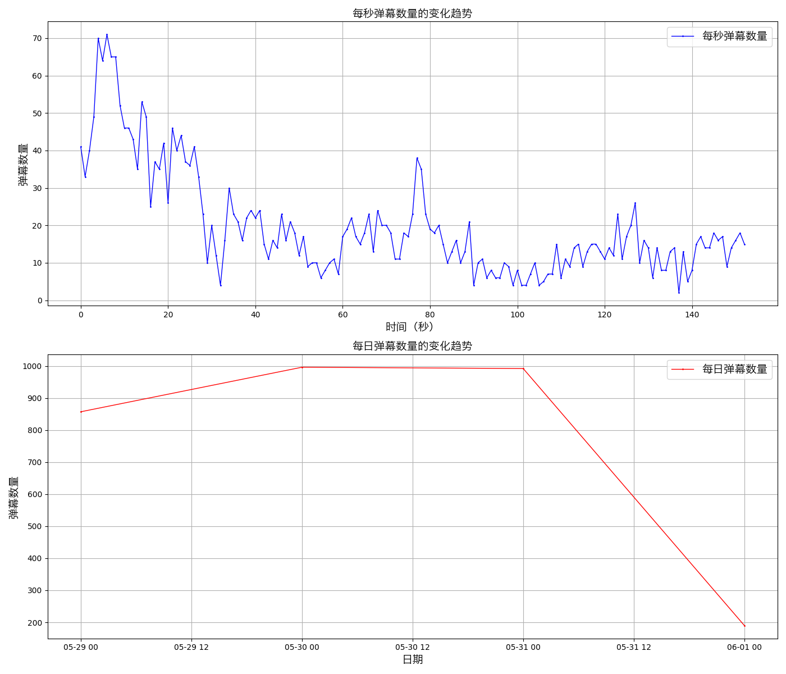

# hello-bilibili
获取噼哩噼哩弹幕数据

## 1.配置venv环境
### 1.1 初始化venv
```shell
python3 -m venv ./vevn
```
```shell
## windows环境使用这个命令
python3 -m venv .\venv
```
### 1.2 激活venv环境 （激活成功后，命令行前会有 (vevn)  标志）
```shell
## mac环境
source ./venv/bin/activate
```
```shell
## windows环境
.\venv\Scripts\activate
```

## 2.venv环境下安装依赖 (pip  pip3 都可，pip不行试试pip3)
```shell
pip3 install -r requirements.txt
```

## 3.爬取弹幕数据
获取请求头中 Cookie中SESSDATA= 开头 ;结尾的数据，保存到 cookie.init中


然后执行以下指令，相关数据会保存在对应bvid根目录下
```shell
python3 crawl.py
```


## 4.分析数据
### 4.1 分析图表
执行以下指令并输入bvid,会在对应根目录下生成分析图片
```shell
python3 drawTable.py
```
示例如下


### 4.2 分析词频
执行以下指令并输入bvid,会在对应bvid目录下生成分析xlsx
```shell
python3 genExcel.py
```